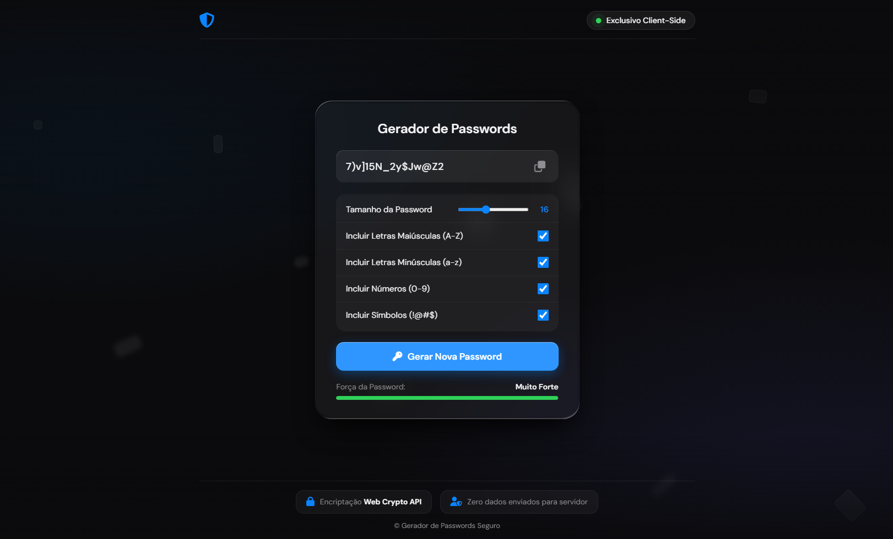

<div align="center">

  # 🔑 Gerador de Passwords Seguro

  <p align="center">
    <b>Uma aplicação moderna, leve e ultra-segura para geração de passwords fortes diretamente no navegador.</b>
  </p>

  <!-- Badges em Flat-Square (Mais clean e moderno) -->
  <p align="center">
    
    
    
    
  </p>

  <br />

  <!-- Preview da Interface -->
  <p align="center">
    
  </p>

</div>

<br />

## 📑 Sobre o Projeto

O **Gerador de Passwords** é uma ferramenta estática focada em privacidade e segurança cibernética. Foi desenhada para combater ataques de força bruta através da criação de credenciais aleatórias, altamente personalizáveis e com alta entropia.

> 🔒 **Privacidade em Primeiro Lugar:** Toda a geração é realizada **100% no lado do cliente (Client-Side)**. Nenhuma informação ou password gerada sai do teu navegador ou é enviada para servidores externos.

---

## ✨ Funcionalidades Destaque

* 🎛️ **Customização Pessoal:** Ajusta o comprimento exato da password entre 6 e 32 caracteres.
* 🔠 **Filtros Avançados:** Ativa ou desativa o uso de maiúsculas, minúsculas, números e símbolos especiais.
* 📋 **Cópia Rápida:** Botão integrado para copiar o resultado para a área de transferência com um clique.
* 📊 **Indicador Dinâmico:** Análise visual em tempo real que mede a robustez estrutural da password criada.
* 🎨 **Visual Liquid Glass:** Interface construída em modo escuro com efeito de vidro fosco (*glassmorphism*) e transições suaves.

---

## 🛠️ Stack Tecnológica

O ecossistema foi desenvolvido utilizando padrões puramente nativos da Web para máxima performance e leveza:

* **Markup & Estrutura:** `HTML5` para semântica limpa.
* **Estilização:** `CSS3` avançado com variáveis globais e efeitos de desfoque de fundo.
* **Lógica de Criptografia:** `JavaScript (ES6+)` nativo para manipulação lógica rápida.
* **Iconografia:** `Font Awesome` para elementos visuais consistentes.

---

## 🚀 Como Executar Localmente

Por ser uma aplicação totalmente estática, **não precisas de instalar dependências complexas** (como Node.js ou bases de dados) nem configurar servidores locais.

1. **Clona este repositório no teu PC:**
   ```bash
   git clone https://github.com/30rex30/Gerador-de-Password.git
   ```

2. **Navega até à pasta do projeto:**
   ```bash
   cd Gerador-de-Password
   ```

3. **Inicia a aplicação:**
   * Basta dar dois cliques no ficheiro `index.html` para abrir o gerador diretamente no teu navegador de eleição.

---

## 🤝 Contribuições

Qualquer feedback ou melhoria é bem-vinda! Sente-se à vontade para abrir uma *Issue* ou enviar um *Pull Request*:

1. Faz um **Fork** do repositório.
2. Cria a tua branch com a nova funcionalidade (`git checkout -b feature/MelhoriaIncrível`).
3. Grava as alterações (`git commit -m 'Adiciona melhoria na interface'`).
4. Envia para o servidor (`git push origin feature/MelhoriaIncrível`).
5. Abre o **Pull Request**.

---

<div align="center">
  <p>Desenvolvido com dedicação por <a href="https://github.com/30rex30">30rex30</a></p>
</div>
